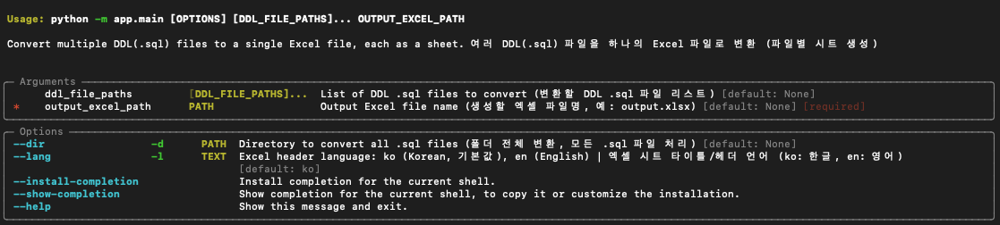
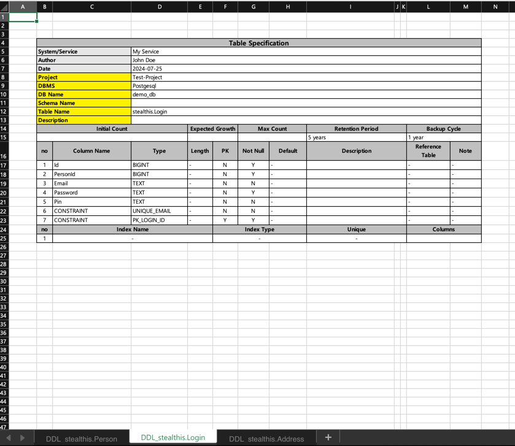

# ddl2excel

SQL DDL 파일을 엑셀 테이블 명세서로 변환하는 Python CLI 도구입니다.

> **참고:**
> **현재는 PostgreSQL DDL만 지원합니다.**
> (MySQL, Oracle 등은 아직 지원하지 않습니다.)

## 사용 예시

### 커맨드라인 실행 화면



### 엑셀 결과 예시



## 요구사항

- Python 3.12+
- [uv](https://github.com/astral-sh/uv) (환경 및 의존성 관리에 권장)

## 빠른 시작 (빌드, 설치 불필요)

```bash
# 1. uv로 가상환경 생성
uv venv

# 2. 모든 의존성 설치 (pyproject.toml/requirements.txt 기반)
uv sync

# 3. 빌드/설치 없이 바로 실행
uv run python -m app.main --help

# 사용 예시:
uv run python -m app.main DDL.sql output.xlsx
uv run python -m app.main --dir ./ddls output.xlsx --lang en
````

## 사용법

```bash
# 단일 .sql → 엑셀
uv run python -m app.main DDL.sql output.xlsx

# 여러 .sql → 엑셀 (각 파일별 시트)
uv run python -m app.main table1.sql table2.sql output.xlsx

# 폴더 내 모든 .sql → 엑셀
uv run python -m app.main --dir ./ddls output.xlsx

# 헤더/타이틀 언어 선택 (기본 한글, en: 영어)
uv run python -m app.main DDL.sql output.xlsx
uv run python -m app.main -d ./ddls output.xlsx
uv run python -m app.main DDL.sql output.xlsx --lang en
```

**참고:**
파일 인자와 `--dir` 옵션을 동시에 사용할 수 없습니다.

## 인터랙티브 메타 입력 안내

프로그램을 실행하면 아래와 같이 프롬프트가 표시됩니다.

Would you like to input table meta fields interactively? [y/N]:
- `y`를 입력하면, 시스템/서비스, 작성자, DBMS 등 주요 메타 정보를 직접 입력할 수 있습니다.
- 엔터(또는 다른 값을 입력)만 치면 모두 빈칸으로 처리됩니다.

```bash
uv run python -m app.main DDL.sql output.xlsx

# 예시 프롬프트:
Would you like to input table meta fields interactively? [y/N]: y
시스템/서비스: 내 서비스
작성자: 홍길동
작성일: 2024-07-25
프로젝트명:
DBMS: PostgreSQL
DB 이름: demo_db
스키마명: public
````

## 주요 옵션

| 옵션         | 설명                                      |
| ---------- | --------------------------------------- |
| FILES      | 변환할 DDL .sql 파일 리스트                     |
| --dir, -d  | 폴더 전체의 .sql 파일 일괄 처리                    |
| --lang, -l | 엑셀 시트 헤더/타이틀 언어: `ko`(한글, 기본), `en`(영어) |
| OUTPUT     | 결과 엑셀 파일 경로                             |

## 프로젝트 구조

```
app/
  ├── main.py           # 커맨드라인 실행부(진입점)
  ├── const.py          # 스타일/라벨(다국어) 상수
  ├── excel_writer.py   # 엑셀 작성 로직
  ├── parser.py         # DDL 파싱 로직
  └── utils.py          # 스타일/병합 유틸리티
```
